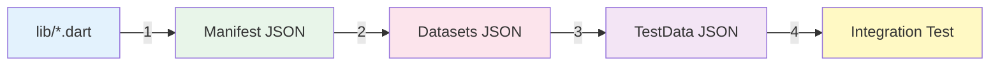

# 📊 Activity Diagrams - ระบบสร้างสคริปต์ทดสอบอัตโนมัติ

> **Flutter Automated Integration Test Generator**
> Activity Diagrams สำหรับแสดงกระบวนการทำงาน 4 ขั้นตอนหลัก

---

## 📋 สารบัญ

1. [ภาพรวมระบบ](#ภาพรวมระบบ)
2. [Diagram 1: การวิเคราะห์และสกัดสมรรถนะส่วนติดต่อผู้ใช้](#diagram-1-การวิเคราะห์และสกัดสมรรถนะส่วนติดต่อผู้ใช้)
3. [Diagram 2: การสร้างข้อมูลทดสอบด้วยระบบเอไอ](#diagram-2-การสร้างข้อมูลทดสอบด้วยระบบเอไอ)
4. [Diagram 3: การออกแบบแผนทดสอบแบบ Pairwise](#diagram-3-การออกแบบแผนทดสอบแบบ-pairwise)
5. [Diagram 4: การสร้างสคริปต์ทดสอบ](#diagram-4-การสร้างสคริปต์ทดสอบ)
6. [การใช้งาน PlantUML Diagrams](#การใช้งาน-plantuml-diagrams)
7. [สรุปและข้อมูลเพิ่มเติม](#สรุปและข้อมูลเพิ่มเติม)

---

## 🎯 ภาพรวมระบบ

ระบบ Flutter Automated Integration Test Generator ประกอบด้วย **4 Process หลัก** ที่ทำงานต่อเนื่องกัน:



### 🔄 ลำดับการทำงาน

| ขั้นตอน | ไฟล์ Tool | Input | Output | เวลาประมาณ |
|---------|----------|-------|--------|------------|
| 1️⃣ | `extract_ui_manifest.dart` | `lib/**/*_page.dart` | `output/manifest/**/*.manifest.json` | ~1-2 วินาที/ไฟล์ |
| 2️⃣ | `generate_datasets.dart` | `output/manifest/**/*.manifest.json` | `output/test_data/*.datasets.json` | ~3-5 วินาที/ไฟล์ (AI) |
| 3️⃣ | `generate_test_data.dart` | `output/manifest/**/*.manifest.json`<br>`output/test_data/*.datasets.json` | `output/test_data/*.testdata.json`<br>`output/model_pairwise/*.txt` | ~2-4 วินาที/ไฟล์ |
| 4️⃣ | `generate_test_script.dart` | `output/test_data/*.testdata.json` | `integration_test/*_flow_test.dart` | ~1-2 วินาที/ไฟล์ |

---

## 🔍 Diagram 1: การวิเคราะห์และสกัดสมรรถนะส่วนติดต่อผู้ใช้

### 📁 ไฟล์: `activity_diagram_1_ui_manifest.puml`

### 🎯 วัตถุประสงค์
วิเคราะห์ไฟล์ Flutter Dart เพื่อสกัดข้อมูล UI widgets และ metadata ต่างๆ ออกมาเป็น JSON

### 📥 Input
- **ไฟล์ Flutter Page**: `lib/demos/*_page.dart`, `lib/**/*_page.dart`
- **รูปแบบ**: Flutter Widget code (StatefulWidget/StatelessWidget)

### 📤 Output
- **ไฟล์ Manifest**: `output/manifest/**/*.manifest.json`
- **โครงสร้าง**:
  ```json
  {
    "source": {
      "file": "lib/demos/register_page.dart",
      "pageClass": "RegisterPage",
      "cubitClass": "RegisterCubit",
      "stateClass": "RegisterState",
      "fileCubit": "lib/cubit/register_cubit.dart",
      "fileState": "lib/cubit/register_state.dart"
    },
    "widgets": [
      {
        "widgetType": "TextFormField",
        "key": "1_customer_firstname_textfield",
        "meta": {
          "keyboardType": "text",
          "maxLength": 50,
          "validatorRules": [
            {
              "condition": "value == null || value.isEmpty",
              "message": "กรุณากรอกชื่อ"
            },
            {
              "condition": "!RegExp(r'^[a-zA-Z]{2,}$').hasMatch(value)",
              "message": "ชื่อต้องมีอย่างน้อย 2 ตัวอักษร"
            }
          ]
        }
      }
    ]
  }
  ```

### 🔧 กระบวนการทำงาน

#### 1. **Pre-processing**
- **ลบ Comments**: ลบ `//` และ `/* */` เพื่อไม่ให้รบกวนการวิเคราะห์
- **สกัด Constants**: ดึง `const VAR = 'value'` เพื่อใช้แทนค่า placeholder

#### 2. **Widget Scanning**
สแกนหา Widget types ต่อไปนี้:
- `TextField`, `TextFormField`
- `ElevatedButton`, `TextButton`, `OutlinedButton`, `IconButton`
- `DropdownButton`, `DropdownButtonFormField`
- `Radio`, `Checkbox`, `Switch`, `SwitchListTile`
- `DatePicker` (via `showDatePicker`), `TimePicker` (via `showTimePicker`)

#### 3. **Metadata Extraction**
สำหรับแต่ละ Widget:
- **Key Extraction**: `Key('...')`, `ValueKey<T>('...')`, `ObjectKey([...])`
- **Validation Rules**: วิเคราะห์ `validator:` closure
  - แยก condition (`if (...)`)
  - แยก message (`return 'message';`)
  - รองรับ ternary `(condition) ? 'msg' : null`
- **Input Formatters**:
  - `FilteringTextInputFormatter.digitsOnly`
  - `FilteringTextInputFormatter.allow(RegExp(...))`
  - `LengthLimitingTextInputFormatter(n)`
- **Picker Metadata**:
  - DatePicker: `firstDate`, `lastDate`, `initialDate`
  - TimePicker: `initialTime`

#### 4. **State Management Detection**
- ค้นหา `BlocBuilder<CubitClass, StateClass>`
- ค้นหา `context.read<CubitClass>()`
- ตรวจสอบ import statements เพื่อหา Cubit/State file paths

#### 5. **Sorting และ Filtering**
- **กรอง**: เก็บเฉพาะ widgets ที่มี `key`
- **Deduplicate**: ลบ duplicate keys (เก็บ first occurrence)
- **เรียง**:
  1. Priority 1: Widgets ที่มี `SEQUENCE` pattern (`1_`, `2_`, `3_`...)
  2. Priority 2: Widgets อื่นๆ ตาม source order

#### 6. **Output Generation**
- คำนวณ output path ตาม subfolder structure
- สร้าง directory หากไม่มี (`recursive: true`)
- เขียน JSON พร้อม indent 2 spaces
- **บันทึกข้อมูล**: บันทึกข้อมูลทั้งหมดเป็นไฟล์ JSON ที่เรียกว่า **Manifest File** โดยเก็บไว้ในโฟลเดอร์ `output/manifest/` พร้อมทั้งแสดงข้อความแจ้งเตือนว่าการสกัดข้อมูลสำเร็จพร้อมเส้นทางของไฟล์ที่สร้างขึ้น
- **⚠️ การกรอง Widgets**: ในกรณีที่วิดเจ็ตไม่มีคีย์หรือไม่พบวิดเจ็ตที่รองรับเลย วิดเจ็ตเหล่านั้นจะถูกกรองออกและไม่รวมอยู่ในไฟล์ Manifest

### 💡 จุดเด่น
- ✅ **Automatic Cubit/State Detection** - ไม่ต้องระบุ manually
- ✅ **SEQUENCE-based Sorting** - จัดเรียงตามลำดับที่ออกแบบไว้
- ✅ **Picker Metadata** - รองรับ DatePicker/TimePicker constraints
- ✅ **Robust Regex Parsing** - รองรับ raw strings, escapes

### ⚠️ ข้อจำกัด
- ไม่รองรับ dynamic widget creation (e.g., `ListView.builder`)
- ต้องมี explicit `Key(...)` (ไม่รองรับ auto-generated keys)
- Validation rules ต้องเป็น inline lambda (ไม่รองรับ extracted functions)

---

## 🤖 Diagram 2: การสร้างข้อมูลทดสอบด้วยระบบเอไอ

### 📁 ไฟล์: `activity_diagram_2_ai_datasets.puml`

### 🎯 วัตถุประสงค์
ใช้ AI (Google Gemini) สร้างข้อมูลทดสอบ (valid/invalid pairs) สำหรับ TextField/TextFormField

### 📥 Input
- **Manifest Files**: `output/manifest/**/*.manifest.json`
- **API Key**: Gemini API key (จาก `.env`, ENV, หรือ hardcoded)

### 📤 Output
- **Dataset Files**: `output/test_data/*.datasets.json`
- **โครงสร้าง**:
  ```json
  {
    "file": "lib/demos/register_page.dart",
    "datasets": {
      "byKey": {
        "1_customer_firstname_textfield": [
          {
            "valid": "Alice",
            "invalid": "A",
            "invalidRuleMessages": "ชื่อต้องมีอย่างน้อย 2 ตัวอักษร"
          },
          {
            "valid": "Bob",
            "invalid": "B",
            "invalidRuleMessages": "ชื่อต้องมีอย่างน้อย 2 ตัวอักษร"
          }
        ],
        "2_customer_email_textfield": [...]
      }
    }
  }
  ```

### 🔧 กระบวนการทำงาน

#### 1. **API Key Resolution**
ลำดับความสำคัญ (Priority):
1. `--api-key` command-line flag
2. `.env` file (`GEMINI_API_KEY=...`)
3. Environment variable
4. Hardcoded constant (for development only)

#### 2. **Field Classification**
แยก TextFormField เป็น 2 กลุ่ม:
- **fieldsWithoutRules**: ไม่มี `validatorRules` → Local generation (1 valid, 0 invalid)
- **fieldsWithRules**: มี `validatorRules` → AI generation (N pairs)

#### 3. **Local Generation (No Rules)**
สำหรับ fields ไม่มี validation rules:
```dart
// วิเคราะห์ constraints
final constraints = _analyzeConstraintsFromMeta(key, meta);
  - keyboardType (email, number, phone)
  - inputFormatters (digitsOnly, allow/deny patterns)
  - maxLength

// สร้าง 1 valid value
final validValue = _generateValidData(key, constraints);
  - Email: "test@example.com"
  - Digits: "123"
  - Text: random alphanumeric

// No invalid values (ไม่มี rules ให้ฝ่าฝืน)
```

#### 4. **AI Generation (With Rules)**

##### 📝 Prompt Structure
```text
=== (CONTEXT) ===
Test data generator for Flutter form validation.

=== (TARGET) ===
QA engineers need realistic test data for happy path and errors.

=== (OBJECTIVE) ===
1. วิเคราะห์ constraints (maxLength, inputFormatters, validatorRules)
2. กรอง isEmpty/null rules (tested separately)
3. สร้าง valid/invalid pairs ONLY for non-empty rules
4. CRITICAL: Invalid values MUST pass inputFormatters but FAIL validators
5. Output valid JSON

=== (EXECUTION) ===
1. นับ non-empty rules (SKIP "isEmpty"/"== null") → N
2. สำหรับแต่ละ non-empty rule: สร้าง 1 valid + 1 invalid pair
3. สร้าง N pairs (total N valid + N invalid)

Example:
Input: {"field":"firstname","validatorRules":[
  {"condition":"value == null || value.isEmpty","message":"Required"},
  {"condition":"!RegExp(r'^[a-zA-Z]{2,}$').hasMatch(value)","message":"Min 2"}]}
Non-empty rules: 1 (SKIP isEmpty) → N=1 pair
Output: {"firstname":[
  {"valid":"Alice","invalid":"A","invalidRuleMessages":"Min 2"}
]}
```

##### 🌐 API Call Flow
```dart
// 1. สร้าง HTTP Client
final client = HttpClient();

// 2. POST request ไปยัง Gemini
final req = await client.postUrl(endpoint);
req.headers.set(HttpHeaders.contentTypeHeader, 'application/json');
req.add(utf8.encode(jsonEncode(payload)));

// 3. รับ response
final resp = await req.close();
final body = await resp.transform(utf8.decoder).join();

// 4. ตรวจสอบ status code
if (resp.statusCode < 200 || resp.statusCode >= 300) {
  throw HttpException('Gemini HTTP ${resp.statusCode}');
}

// 5. Parse JSON
final decoded = jsonDecode(body);
final text = _extractTextFromGemini(decoded);

// 6. ลบ markdown fences (```json ... ```)
final cleaned = _stripCodeFences(text);

// 7. Parse เป็น datasets
final parsed = jsonDecode(cleaned);
```

#### 5. **Post-processing**
- **Normalize maxLength**: ตัด valid values ที่ยาวเกิน `maxLength`
- **Keep invalid as-is**: invalid values สามารถเกิน `maxLength` เพื่อทดสอบ

#### 6. **Merge และ Output**
```dart
final result = {
  'file': uiFile,
  'datasets': {
    'byKey': {
      // fields without rules (local)
      'field1': [{'valid': '...', 'invalid': ''}],
      // fields with rules (AI)
      'field2': [{'valid': '...', 'invalid': '...', 'invalidRuleMessages': '...'}]
    }
  }
};
```

### 💡 จุดเด่น
- ✅ **AI-Powered**: สร้าง realistic test data อัตโนมัติ
- ✅ **Rule-Aware**: Invalid values ผ่าน input formatters แต่ fail validators
- ✅ **Multilingual**: รองรับ Thai/English validation messages
- ✅ **Local Fallback**: มี `--local-only` mode สำหรับ offline

### ⚠️ ข้อจำกัด
- ต้องมี API key สำหรับ mode ปกติ
- AI response อาจไม่ perfect 100% (ต้อง verify)
- Rate limits จาก Gemini API (free tier: 15 requests/minute)

---

## 🔀 Diagram 3: การออกแบบแผนทดสอบแบบ Pairwise

### 📁 ไฟล์: `activity_diagram_3_pairwise_plan.puml`

### 🎯 วัตถุประสงค์
สร้างแผนการทดสอบแบบ Pairwise Testing เพื่อลดจำนวน test cases แต่คงความครอบคลุม

### 📥 Input
- **Manifest Files**: `output/manifest/**/*.manifest.json`
- **Dataset Files**: `output/test_data/*.datasets.json`
- **PICT Binary**: `./pict` (Pairwise Independent Combinatorial Testing tool)

### 📤 Output
- **Test Plan Files**: `output/test_data/*.testdata.json`
- **PICT Model Files**: `output/model_pairwise/*.txt`
- **PICT Result Files**: `output/model_pairwise/*.result.txt`

### 🔧 กระบวนการทำงาน

#### 1. **Widget Classification**
แยก widgets เป็นกลุ่ม:
```dart
final textKeys = [];        // TextFormField keys
final radioKeys = [];       // Radio widget keys
final dropdownKeys = [];    // Dropdown keys
final checkboxKeys = [];    // Checkbox keys
final datePickerKeys = [];  // DatePicker keys
final timePickerKeys = [];  // TimePicker keys
final endKey = ...;         // Submit button (highest SEQUENCE)
```

#### 2. **Factor Creation**
สร้าง PICT factors:

| Widget Type | Factor Name | Values |
|-------------|-------------|--------|
| TextField #1 | `TEXT` | `{valid, invalid}` |
| TextField #2 | `TEXT2` | `{valid, invalid}` |
| TextField #3 | `TEXT3` | `{valid, invalid}` |
| Radio Group #1 | `Radio1` | `{option1_radio, option2_radio, ...}` |
| Dropdown | `Dropdown` | `{value1, value2, value3}` |
| Checkbox #1 | `Checkbox` | `{checked, unchecked}` |
| DatePicker | `customer_07_birthdate_field` | `{15/01/2000, null, ...}` |
| TimePicker | `customer_08_time_field` | `{09:00, 14:30, null}` |

#### 3. **PICT Model Generation**
สร้าง 2 model files:

**3.1. Full Model** (`<page>.full.model.txt`):
```
TEXT: valid, invalid
TEXT2: valid, invalid
Radio1: option1_radio, option2_radio, option3_radio
Dropdown: value1, value2, value3
Checkbox: checked, unchecked
customer_07_birthdate_field: 15/01/2000, 25/06/1995, null

# Constraints
IF [TEXT] = "invalid" THEN [TEXT2] <> "invalid";
```

**3.2. Valid-Only Model** (`<page>.valid.model.txt`):
```
TEXT: valid
TEXT2: valid
Radio1: option1_radio, option2_radio, option3_radio
Dropdown: value1, value2, value3
Checkbox: checked, unchecked
customer_07_birthdate_field: 15/01/2000, 25/06/1995, null
```

#### 4. **PICT Execution**
```bash
./pict <page>.full.model.txt > <page>.full.result.txt
./pict <page>.valid.model.txt > <page>.valid.result.txt
```

**PICT Result Example**:
```
TEXT	TEXT2	Radio1	Dropdown	Checkbox
valid	valid	option1_radio	value1	checked
valid	invalid	option2_radio	value2	unchecked
invalid	valid	option3_radio	value3	checked
invalid	invalid	option1_radio	value1	unchecked
...
```

#### 5. **Test Case Generation**

##### 5.1. Parse PICT Result
```dart
final combos = pict.parsePictResult(File(pageResultPath).readAsStringSync());
// combos = [
//   {'TEXT': 'valid', 'TEXT2': 'valid', 'Radio1': 'option1_radio', ...},
//   {'TEXT': 'valid', 'TEXT2': 'invalid', 'Radio1': 'option2_radio', ...},
//   ...
// ]
```

##### 5.2. สร้าง Test Steps
สำหรับแต่ละ combination:
```dart
// Build steps dictionary (preserve widget order)
final stepsByKey = <String, List<Map<String, dynamic>>>{};

// 1. TextField factors
for (TEXT factor) {
  final bucket = combo['TEXT']; // 'valid' or 'invalid'
  stepsByKey[textKey] = [
    {'enterText': {'byKey': textKey, 'dataset': 'byKey.$textKey[0].$bucket'}},
    {'pump': true}
  ];
}

// 2. Radio factors
for (Radio factor) {
  final pick = combo['Radio1']; // 'option1_radio'
  final matchedKey = _radioKeyForSuffix(radioKeys, pick);
  stepsByKey[matchedKey] = [
    {'tap': {'byKey': matchedKey}},
    {'pump': true}
  ];
}

// 3. Dropdown factors
final ddPick = combo['Dropdown']; // 'value1'
stepsByKey[dropdownKey] = [
  {'tap': {'byKey': dropdownKey}},
  {'pump': true},
  {'tapText': valueToTextMapping[ddPick]}, // Use display text
  {'pump': true}
];

// 4. Checkbox factors
if (combo['Checkbox'] == 'checked') {
  stepsByKey[checkboxKey] = [
    {'tap': {'byKey': checkboxKey}},
    {'pump': true}
  ];
}

// 5. DatePicker factors
final datePick = combo['customer_07_birthdate_field']; // '15/01/2000'
stepsByKey[datePickerKey] = [
  {'tap': {'byKey': datePickerKey}},
  {'pumpAndSettle': true},
  {'selectDate': datePick},  // 'DD/MM/YYYY' or 'null'
  {'pumpAndSettle': true}
];

// 6. End Button
if (endKey != null) {
  steps.add({'tap': {'byKey': endKey}});
  steps.add({'pumpAndSettle': true});
}
```

##### 5.3. สร้าง Assertions
```dart
bool hasInvalidData = steps.any((s) => s.contains('invalid'));

if (hasInvalidData) {
  // Failed case: expect validation error messages
  for (invalidField in invalidFields) {
    final invalidMsg = datasets['byKey'][invalidField][0]['invalidRuleMessages'];
    // Only include non-empty/non-required messages
    if (invalidMsg != null && !invalidMsg.contains('Required')) {
      asserts.add({'text': invalidMsg, 'exists': true});
    }
  }
  // Expect fail keys
  for (failKey in expectedFailKeys) {
    asserts.add({'byKey': failKey, 'exists': true});
  }
} else {
  // Success case: expect success keys
  for (successKey in expectedSuccessKeys) {
    asserts.add({'byKey': successKey, 'exists': true});
  }
}
```

#### 6. **Edge Cases**
สร้าง empty-all-fields test case:
```dart
// Analyze required fields
final expectedMsgsCount = <String, int>{};
for (widget in widgets) {
  for (rule in widget.meta.validatorRules) {
    if (_isEmptyCheckCondition(rule.condition)) {
      expectedMsgsCount[rule.message]++;
    }
  }
}

// Create empty test case
cases.add({
  'tc': 'edge_cases_empty_all_fields',
  'kind': 'failed',
  'group': 'edge_cases',
  'steps': [
    {'tap': {'byKey': endKey}},
    {'pumpAndSettle': true}
  ],
  'asserts': [
    for (entry in expectedMsgsCount.entries)
      {'text': entry.key, 'exists': true, 'count': entry.value}
  ]
});
```

#### 7. **Output Structure**
```json
{
  "source": {...},
  "datasets": {...},
  "cases": [
    {
      "tc": "pairwise_valid_invalid_cases_1",
      "kind": "success",
      "group": "pairwise_valid_invalid_cases",
      "steps": [...],
      "asserts": [...]
    },
    {
      "tc": "pairwise_valid_invalid_cases_2",
      "kind": "failed",
      "group": "pairwise_valid_invalid_cases",
      "steps": [...],
      "asserts": [...]
    },
    {
      "tc": "edge_cases_empty_all_fields",
      "kind": "failed",
      "group": "edge_cases",
      "steps": [...],
      "asserts": [...]
    }
  ]
}
```

### 💡 จุดเด่น
- ✅ **Pairwise Coverage**: ลด test cases จาก O(n^m) → O(n²) โดยคง 2-way coverage
- ✅ **PICT Integration**: ใช้ Microsoft PICT tool (industry standard)
- ✅ **DatePicker/TimePicker Support**: สร้าง date/time values ภายใน constraints
- ✅ **Widget Order Preservation**: จัดเรียง steps ตาม manifest order

### 📊 ตัวอย่าง Test Case Reduction

| Widgets | Full Factorial | Pairwise (PICT) | Reduction |
|---------|---------------|----------------|-----------|
| 3 TextFields (2 values each) | 2³ = 8 | 4 | 50% |
| 5 TextFields + 1 Dropdown (3) | 2⁵ × 3 = 96 | 12 | 87.5% |
| 10 factors (avg 3 values) | 3¹⁰ = 59,049 | ~40 | 99.9% |

### ⚠️ ข้อจำกัด
- ต้องมี PICT binary (`./pict`) ใน project root
- PICT ไม่รองรับ Unicode (ต้องแปลง Thai → ASCII values)
- Constraints ต้องเขียนใน PICT syntax (learning curve)

---

## 🎬 Diagram 4: การสร้างสคริปต์ทดสอบ

### 📁 ไฟล์: `activity_diagram_4_test_script.puml`

### 🎯 วัตถุประสงค์
แปลง Test Plan (JSON) เป็น Flutter Integration Test Code (Dart) ที่พร้อมรัน

### 📥 Input
- **Test Plan Files**: `output/test_data/*.testdata.json`
- **External Datasets**: `output/test_data/*.datasets.json` (optional)

### 📤 Output
- **Integration Test Files**: `integration_test/*_flow_test.dart`

### 🔧 กระบวนการทำงาน

#### 1. **Parse Test Plan**
```dart
final j = jsonDecode(File(planPath).readAsStringSync());
final source = j['source'];
  - file, pageClass, cubitClass, stateClass
final datasets = j['datasets'];
  - byKey: {field: [{valid, invalid, invalidRuleMessages}]}
final cases = j['cases'];
  - tc, kind, group, steps, asserts
```

#### 2. **Generate Imports**
```dart
import 'package:flutter/material.dart';
import 'package:flutter_test/flutter_test.dart';
import 'package:integration_test/integration_test.dart';
import 'package:flutter_bloc/flutter_bloc.dart';

// Import Page, Cubit, State
import 'package:master_project/demos/register_page.dart';
import 'package:master_project/cubit/register_cubit.dart';
import 'package:master_project/cubit/register_state.dart';
```

#### 3. **Generate Cubit Stubs**
สร้าง stub classes สำหรับจำลอง API:

**Success Stub**:
```dart
class _SuccessRegisterCubit extends RegisterCubit {
  final ApiResponse? stubResp;
  _SuccessRegisterCubit({this.stubResp}) : super(shouldSucceed: true);

  @override
  Future<void> onEndButton() async {
    final resp = stubResp ?? const ApiResponse(message: "ok", code: 200);
    emit(state.copyWith(response: resp, exception: null));
  }

  @override
  Future<void> callApi() async {
    final resp = stubResp ?? const ApiResponse(message: "ok", code: 200);
    emit(state.copyWith(response: resp, exception: null));
  }
}
```

**Failure Stub**:
```dart
class _FailRegisterCubit extends RegisterCubit {
  final int code;
  _FailRegisterCubit(this.code) : super(shouldSucceed: false);

  @override
  Future<void> callApi() async {
    emit(state.copyWith(
      exception: RegisterException(message: "api_failed", code: code)
    ));
  }

  @override
  Future<void> onEndButton() async {
    emit(state.copyWith(
      exception: RegisterException(message: "api_failed", code: code)
    ));
  }
}
```

#### 4. **Generate Helper Functions**
```dart
Widget _wrap(Widget child, {
  required bool success,
  Map<String, dynamic>? response,
  int? failureCode
}) {
  final providers = <BlocProvider>[];
  providers.add(
    BlocProvider<RegisterCubit>(
      create: (_) => success
        ? _SuccessRegisterCubit(
            stubResp: response != null ? ApiResponse.fromJson(response) : null
          )
        : (failureCode != null ? _FailRegisterCubit(failureCode) : RegisterCubit())
    )
  );
  return MaterialApp(
    home: MultiBlocProvider(
      providers: providers,
      child: child
    )
  );
}
```

#### 5. **Generate Test Groups**
จัดกลุ่ม test cases ตาม `group` field:
```dart
void main() {
  IntegrationTestWidgetsFlutterBinding.ensureInitialized();

  group('register_page.dart flow (integration)', () {
    group('pairwise_valid_invalid_cases', () {
      // Test cases...
    });

    group('edge_cases', () {
      // Test cases...
    });
  });
}
```

#### 6. **Generate Test Cases**

##### 6.1. Test Setup
```dart
testWidgets('pairwise_valid_invalid_cases_1', (tester) async {
  // Create providers
  final providers = <BlocProvider>[
    BlocProvider<RegisterCubit>(create: (_) => RegisterCubit()),
  ];

  // Wrap and pump
  final w = MaterialApp(
    home: MultiBlocProvider(
      providers: providers,
      child: RegisterPage()
    )
  );
  await tester.pumpWidget(w);
```

##### 6.2. Generate Steps
แปลง JSON steps เป็น Dart code:

**enterText Step**:
```json
{"enterText": {"byKey": "1_firstname_textfield", "dataset": "byKey.1_firstname_textfield[0].valid"}}
```
↓
```dart
// dataset: byKey.1_firstname_textfield[0].valid
await tester.enterText(
  find.byKey(const Key('1_firstname_textfield')),
  'Alice'
);
await tester.pump();
```

**tap Step**:
```json
{"tap": {"byKey": "customer_04_age_10_20_radio"}}
```
↓
```dart
await tester.ensureVisible(find.byKey(const Key('customer_04_age_10_20_radio')));
await tester.tap(find.byKey(const Key('customer_04_age_10_20_radio')));
await tester.pump();
```

**selectDate Step**:
```json
{"selectDate": "15/01/2000"}
```
↓
```dart
// Select date: 15/01/2000
{
  // Wait for DatePicker
  await tester.pumpAndSettle(const Duration(milliseconds: 500));

  // Tap year header to open year picker
  final yearInHeader = find.byWidgetPredicate(
    (widget) => widget is Text && (widget.data ?? '').contains('202'),
  );
  if (tester.any(yearInHeader)) {
    await tester.tap(yearInHeader.first);
    await tester.pumpAndSettle();
  }

  // Wait for year picker to load
  int waitAttempts = 0;
  while (waitAttempts < 50) {
    await tester.pump(const Duration(milliseconds: 50));
    final yearItems = find.byWidgetPredicate(
      (w) => w is Text && RegExp(r'^\d{4}$').hasMatch(w.data ?? ''),
    );
    if (tester.any(yearItems)) {
      await tester.pumpAndSettle();
      break;
    }
    waitAttempts++;
  }

  // Scroll to find year 2000
  int scrollAttempts = 0;
  bool scrollingUp = true;
  while (!tester.any(find.text('2000')) && scrollAttempts < 30) {
    final scrollable = find.byType(Scrollable);
    if (tester.any(scrollable)) {
      final offset = scrollingUp ? const Offset(0, -300) : const Offset(0, 300);
      await tester.drag(scrollable.first, offset);
      await tester.pumpAndSettle();
      if (scrollAttempts == 15) scrollingUp = false;
    }
    scrollAttempts++;
  }

  // Tap year
  if (tester.any(find.text('2000'))) {
    await tester.tap(find.text('2000'), warnIfMissed: false);
    await tester.pumpAndSettle();
  }
}

// Navigate to January
{
  int monthNavAttempts = 0;
  while (!tester.any(find.textContaining('Jan')) && monthNavAttempts < 12) {
    if (tester.any(find.byIcon(Icons.chevron_right))) {
      await tester.tap(find.byIcon(Icons.chevron_right));
      await tester.pumpAndSettle();
    }
    monthNavAttempts++;
  }
}

await tester.tap(find.text('15').first);
await tester.pumpAndSettle();
await tester.tap(find.text('OK'));
```

**selectTime Step**:
```json
{"selectTime": "09:00"}
```
↓
```dart
// Select time: 09:00
await tester.tap(find.text('09').first);
await tester.pumpAndSettle();
await tester.tap(find.text('00').first);
await tester.pumpAndSettle();
await tester.tap(find.text('OK'));
```

##### 6.3. Generate Assertions
แปลง JSON asserts เป็น expect():

**byKey exists**:
```json
{"byKey": "customer_success_snackbar", "exists": true}
```
↓
```dart
expect(find.byKey(const Key('customer_success_snackbar')), findsOneWidget);
```

**text exists with count**:
```json
{"text": "กรุณากรอกชื่อ", "exists": true, "count": 2}
```
↓
```dart
expect(find.text('กรุณากรอกชื่อ'), findsNWidgets(2));
```

**OR logic (integration tests)**:
```json
[
  {"byKey": "success_key", "exists": true},
  {"text": "Success message", "exists": true}
]
```
↓
```dart
// Check if any expected element exists (OR logic)
final expected = [
  find.byKey(const Key('success_key')),
  find.text('Success message'),
];
expect(
  expected.any((f) => f.evaluate().isNotEmpty),
  isTrue,
  reason: 'Expected at least one of the elements to exist'
);
```

#### 7. **Dataset Resolution**
Resolve dataset paths แบบ robust:
```dart
dynamic _resolveDataset(Map<String, dynamic> root, String rawPath) {
  // Support: 'byKey.field[0].valid'
  //          'byKey.field.valid[0]'
  //          'datasets.byKey.field[0].invalid'

  String path = rawPath.trim();
  dynamic cur = root;

  for (segment in path.split('.')) {
    // Parse 'field[0]' → key='field', index=0
    final m = RegExp(r'^(.*?)(?:\[(\d+)\])?$').firstMatch(segment);
    final key = m.group(1).trim();
    final idxStr = m.group(2);

    // Navigate to key
    if (cur is Map && cur.containsKey(key)) {
      cur = cur[key];
    } else {
      return null;
    }

    // Navigate to index
    if (idxStr != null) {
      final i = int.tryParse(idxStr);
      if (cur is List && i >= 0 && i < cur.length) {
        cur = cur[i];
      } else {
        return null;
      }
    }
  }

  return cur;
}
```

**ตัวอย่าง**:
- `"byKey.1_firstname_textfield[0].valid"` → `"Alice"`
- `"byKey.2_email_textfield[0].invalid"` → `"invalid.email"`
- `"byKey.3_password_textfield[0].invalidRuleMessages"` → `"รหัสผ่านต้องมีอย่างน้อย 8 ตัวอักษร"`

#### 8. **Output File Structure**
```dart
// GENERATED — Integration tests for full flow
import 'package:flutter/material.dart';
import 'package:flutter_test/flutter_test.dart';
import 'package:integration_test/integration_test.dart';
import 'package:flutter_bloc/flutter_bloc.dart';
import 'package:master_project/cubit/register_cubit.dart';
import 'package:master_project/cubit/register_state.dart';
import 'package:master_project/demos/register_page.dart';

void main() {
  IntegrationTestWidgetsFlutterBinding.ensureInitialized();

  group('register_page.dart flow (integration)', () {
    group('pairwise_valid_invalid_cases', () {
      testWidgets('pairwise_valid_invalid_cases_1', (tester) async {
        // Test code...
      });
      // More test cases...
    });

    group('edge_cases', () {
      testWidgets('edge_cases_empty_all_fields', (tester) async {
        // Test code...
      });
    });
  });
}
```

### 💡 จุดเด่น
- ✅ **Integration Test Ready**: ใช้ real BlocProviders กับ backend จริง
- ✅ **Robust DatePicker/TimePicker**: รองรับ year scrolling, month navigation
- ✅ **OR Logic Assertions**: ยืดหยุ่นสำหรับ success/fail scenarios
- ✅ **Dataset Path Resolution**: รองรับ format หลากหลาย

### ⚠️ ข้อจำกัด
- DatePicker scrolling อาจช้าบน slow devices (ใช้ timeouts)
- OR logic assertions อาจ pass ถึงแม้เจอแค่บางส่วน (trade-off flexibility)
- Cubit stubs ต้อง override methods ที่ถูกต้อง (depends on implementation)

---

## 🚀 การใช้งาน PlantUML Diagrams

### 📥 ติดตั้ง PlantUML

#### Option 1: VS Code Extension
1. ติดตั้ง extension: [PlantUML by jebbs](https://marketplace.visualstudio.com/items?itemName=jebbs.plantuml)
2. ติดตั้ง Java Runtime (required):
   ```bash
   brew install openjdk@11  # macOS
   sudo apt install openjdk-11-jre  # Ubuntu
   ```
3. เปิดไฟล์ `.puml` และกด `Alt+D` (Preview)

#### Option 2: Command Line
```bash
# ติดตั้ง PlantUML CLI
brew install plantuml  # macOS
sudo apt install plantuml  # Ubuntu

# สร้าง PNG/SVG
plantuml docs/activity_diagram_1_ui_manifest.puml
plantuml -tsvg docs/activity_diagram_2_ai_datasets.puml
```

#### Option 3: Online Editor
- เปิด [PlantUML Online Editor](http://www.plantuml.com/plantuml/uml/)
- Copy-paste เนื้อหาจากไฟล์ `.puml`
- Export เป็น PNG/SVG/PDF

### 📂 ไฟล์ Diagrams

```
docs/
├── activity_diagram_1_ui_manifest.puml      # Diagram 1
├── activity_diagram_2_ai_datasets.puml      # Diagram 2
├── activity_diagram_3_pairwise_plan.puml    # Diagram 3
├── activity_diagram_4_test_script.puml      # Diagram 4
└── ACTIVITY_DIAGRAMS_README.md              # เอกสารนี้
```

### 🎨 Customize Diagrams

แก้ไข skinparam สำหรับเปลี่ยนสี/style:
```plantuml
@startuml
skinparam activityBackgroundColor #E3F2FD  ' สีพื้นหลัง activities
skinparam activityBorderColor #1976D2      ' สีกรอบ
skinparam decisionBackgroundColor #FFF9C4  ' สีพื้นหลัง decisions
skinparam decisionBorderColor #F57F17      ' สีกรอบ decisions
@enduml
```

---

## 📖 สรุปและข้อมูลเพิ่มเติม

### 🎯 สรุป 4 Process

| Process | หน้าที่ | เทคโนโลยีหลัก | ความซับซ้อน |
|---------|---------|----------------|------------|
| 1️⃣ UI Manifest | สกัด UI widgets | Regex, AST parsing | ⭐⭐⭐ |
| 2️⃣ AI Datasets | สร้างข้อมูลทดสอบ | Gemini API, Prompt Engineering | ⭐⭐⭐⭐ |
| 3️⃣ Pairwise Plan | สร้างแผนทดสอบ | PICT tool, Combinatorial testing | ⭐⭐⭐⭐⭐ |
| 4️⃣ Test Script | สร้างโค้ดทดสอบ | Code generation, Template engine | ⭐⭐⭐ |

### 📊 ข้อมูลสถิติ

**ตัวอย่าง Project: Customer Registration Form**
- **Widgets**: 10 TextFields, 3 Radio groups, 1 Dropdown, 2 Checkboxes, 1 DatePicker
- **Full Factorial**: 2¹⁰ × 3³ × 3 × 2² × 4 = 442,368 test cases
- **Pairwise (PICT)**: **68 test cases** (99.985% reduction!)
- **Generation Time**: ~15 seconds total
- **Test Execution Time**: ~3 minutes (all tests)

### 🔗 เอกสารอ้างอิง

- **PICT Tool**: https://github.com/microsoft/pict
- **Gemini API**: https://ai.google.dev/gemini-api/docs
- **PlantUML**: https://plantuml.com/activity-diagram-beta
- **Flutter Testing**: https://docs.flutter.dev/testing/integration-tests

### 🆘 Troubleshooting

#### ❌ PICT binary not found
```bash
# Download PICT for your platform
wget https://github.com/microsoft/pict/releases/download/v3.7.4/pict-darwin-arm64
chmod +x pict-darwin-arm64
mv pict-darwin-arm64 ./pict
```

#### ❌ Gemini API rate limit
- Free tier: 15 requests/minute
- Solution: เพิ่มเวลา delay ระหว่าง requests หรือ upgrade plan

#### ❌ PlantUML rendering error
- ตรวจสอบ Java runtime: `java -version`
- ลองใช้ online editor แทน

### 📧 ติดต่อ

- **Repository**: https://github.com/YOUR_USERNAME/master_project_v2
- **Issues**: https://github.com/YOUR_USERNAME/master_project_v2/issues
- **Email**: your.email@example.com

---

**Last Updated**: 2026-01-13
**Version**: 1.0.0
**Author**: Claude Sonnet 4.5 + Human Collaboration 🤝
